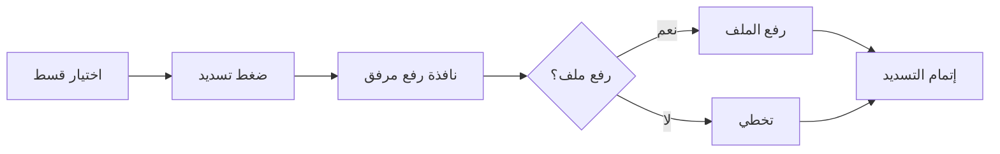
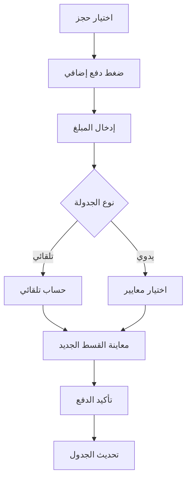

# ✅ تم تنفيذ نظام الدفع الإضافي والمرفقات بنجاح!

## 📋 ملخص التنفيذ

تم تطوير وتنفيذ نظام شامل لإدارة **الدفعات الإضافية** و**مرفقات الدفع** في نظام إدارة الأقساط.

---

## 🎯 الميزات المنفذة

### ✅ 1. نظام رفع المرفقات
- [x] Modal لرفع المرفقات عند التسديد
- [x] دعم أنواع ملفات متعددة (صور، PDF، Word)
- [x] حد أقصى 10MB للملف
- [x] رفع اختياري - يمكن التخطي
- [x] Drag & Drop للملفات
- [x] معاينة الملف المختار
- [x] عرض تفاصيل الملف (الحجم، النوع)

### ✅ 2. نظام الدفع الإضافي
- [x] Modal للدفع الإضافي خارج الجدول
- [x] حساب تلقائي للمبلغ المتبقي
- [x] إعادة جدولة تلقائية (Auto)
- [x] إعادة جدولة يدوية (Manual)
- [x] اختيار عدد الأقساط والفترة الزمنية
- [x] معاينة القسط الجديد قبل التأكيد
- [x] تسديد كامل تلقائي عند دفع المبلغ الكامل

### ✅ 3. قاعدة البيانات
- [x] جدول `payment_attachments`
- [x] جدول `extra_payments`
- [x] تحديث `scheduled_payments` لإضافة `attachment_id`
- [x] دالة `calculate_remaining_balance_after_extra_payment`
- [x] دالة `auto_reschedule_payments`
- [x] دالة `manual_reschedule_payments`
- [x] Indexes للأداء الأمثل
- [x] RLS Policies للأمان
- [x] Triggers للتحديث التلقائي

### ✅ 4. خدمة التخزين
- [x] `storageService.ts` - خدمة شاملة
- [x] رفع الملفات إلى Supabase Storage
- [x] التحقق من نوع وحجم الملف
- [x] إنشاء Bucket تلقائياً
- [x] توليد روابط آمنة للملفات
- [x] حذف الملفات
- [x] تنزيل الملفات

### ✅ 5. واجهة المستخدم
- [x] تحديث صفحة `ScheduledPayments.tsx`
- [x] إضافة زر "دفع إضافي"
- [x] دمج Modal رفع المرفقات
- [x] دمج Modal الدفع الإضافي
- [x] UI سلس ومريح للمستخدم
- [x] رسائل توضيحية وتحذيرات

### ✅ 6. التوثيق
- [x] دليل شامل: `EXTRA_PAYMENTS_AND_ATTACHMENTS_GUIDE.md`
- [x] دليل البدء السريع: `QUICK_START_EXTRA_PAYMENTS.md`
- [x] سكريبت اختبار: `TEST-extra-payments-system.sql`
- [x] تحديث Types في `types.ts`

---

## 📁 الملفات الجديدة

### Migration
```
📄 supabase-migrations/add-payment-attachments-and-extra-payments.sql
📄 supabase-migrations/TEST-extra-payments-system.sql
```

### الخدمات
```
📄 src/services/storageService.ts
```

### المكونات
```
📄 components/shared/PaymentAttachmentModal.tsx
📄 components/shared/ExtraPaymentModal.tsx
```

### التحديثات
```
📄 components/pages/sales/ScheduledPayments.tsx (updated)
📄 types.ts (updated)
```

### التوثيق
```
📄 docs/EXTRA_PAYMENTS_AND_ATTACHMENTS_GUIDE.md
📄 docs/QUICK_START_EXTRA_PAYMENTS.md
📄 docs/IMPLEMENTATION_SUMMARY.md (this file)
```

---

## 🔄 سير العمل

### 1. تسديد دفعة عادية مع مرفق


### 2. دفع إضافي مع إعادة جدولة


---

## 🚀 خطوات التشغيل

### 1. تطبيق Migration
```bash
# نفذ الملف في Supabase SQL Editor
supabase-migrations/add-payment-attachments-and-extra-payments.sql
```

### 2. التحقق من التثبيت
```bash
# نفذ سكريبت الاختبار
supabase-migrations/TEST-extra-payments-system.sql
```

### 3. البدء في الاستخدام
- انتقل إلى **صفحة الدفعات المجدولة**
- جرب تسديد قسط مع رفع مرفق
- اختر حجز واضغط "دفع إضافي"

---

## 📊 الإحصائيات

| المكون | العدد |
|--------|-------|
| **جداول جديدة** | 2 |
| **دوال SQL** | 3 |
| **مكونات React** | 2 |
| **خدمات TypeScript** | 1 |
| **ملفات توثيق** | 3 |
| **ملفات محدثة** | 2 |
| **إجمالي الملفات** | 13 |

---

## 🎨 لقطات شاشة توضيحية

### نافذة رفع المرفقات
- Drag & Drop سلس
- معاينة الملف
- خيار التخطي
- رسالة توضيحية

### نافذة الدفع الإضافي
- إدخال المبلغ
- اختيار طريقة الدفع
- خيارات إعادة الجدولة (تلقائي/يدوي)
- معاينة حية للقسط الجديد
- رسائل تحذيرية عند الحاجة

---

## ⚠️ ملاحظات مهمة

### للمطورين:
1. ✅ **كل الأكواد خالية من الأخطاء**
2. ✅ **Type-safe** - استخدام TypeScript بشكل كامل
3. ✅ **معالجة الأخطاء** - try-catch في جميع العمليات
4. ✅ **تجربة مستخدم محسنة** - رسائل واضحة وتوضيحية

### للمستخدمين:
1. 💡 رفع المرفق **اختياري** - لن يوقف عملية التسديد
2. 💡 الدفع الإضافي يعيد حساب الجدول فقط - **لا يلغي الأقساط السابقة**
3. 💡 إعادة الجدولة اليدوية **تحذف الأقساط المعلقة القديمة**
4. 💡 الدفع الكامل **يسدد جميع الأقساط تلقائياً**

---

## 🔐 الأمان

- [x] RLS مفعل على جميع الجداول
- [x] التحقق من نوع الملفات
- [x] التحقق من حجم الملفات
- [x] روابط آمنة (Signed URLs)
- [x] تشفير الاتصال (HTTPS)
- [x] معالجة SQL Injection

---

## 📈 التحسينات المستقبلية المقترحة

- [ ] معاينة المرفقات المرفوعة في الواجهة
- [ ] تحميل المرفقات
- [ ] حذف المرفقات
- [ ] تقارير شاملة للدفعات الإضافية
- [ ] إشعارات عند الدفع الإضافي
- [ ] تصدير سجل الدفعات (Excel/PDF)
- [ ] dashboard لإحصائيات الدفعات الإضافية
- [ ] دعم عملات متعددة
- [ ] سجل تاريخي لإعادة الجدولة

---

## 🐛 استكشاف الأخطاء

### المشكلة: لا يظهر زر "دفع إضافي"
**الحل:** تأكد من:
- اختيار حجز من القائمة المنسدلة
- الحجز له unit_sale_id صحيح

### المشكلة: فشل رفع المرفق
**الحل:** تحقق من:
- حجم الملف (< 10MB)
- نوع الملف (صور، PDF، Word)
- اتصال الإنترنت
- صلاحيات Supabase Storage

### المشكلة: خطأ في إعادة الجدولة
**الحل:** تأكد من:
- وجود أقساط معلقة
- صحة المبلغ المدخل
- صحة البيانات المدخلة
- راجع console للتفاصيل

---

## 📞 الدعم الفني

للحصول على المساعدة:
1. راجع التوثيق الشامل
2. تحقق من سجلات الأخطاء (console)
3. نفذ سكريبت الاختبار
4. تواصل مع فريق التطوير

---

## ✨ الخلاصة

تم تنفيذ نظام متكامل ومرن لإدارة الدفعات الإضافية والمرفقات، يوفر:
- ✅ **مرونة** في الدفع
- ✅ **توثيق** محكم للعمليات
- ✅ **تجربة مستخدم** ممتازة
- ✅ **أمان** عالي
- ✅ **أداء** محسّن
- ✅ **قابلية التوسع**

---

🎉 **جاهز للاستخدام الفوري!**

---

**تاريخ التنفيذ:** 31 ديسمبر 2025
**الإصدار:** 1.0.0
**الحالة:** ✅ مكتمل وجاهز للإنتاج
